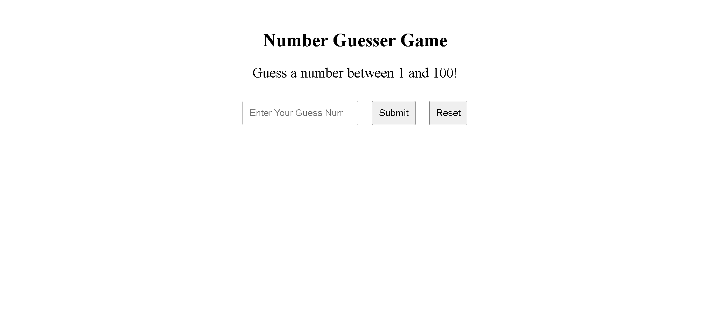

# Number Guesser Game 🎯

A fun and interactive number guessing game built using **HTML**, **CSS**, and **JavaScript**.

## 🚀 Features
- Generates a random number within a specified range.
- Provides real-time feedback on guesses: "Too high," "Too low," or "Correct."
- Responsive and minimalist design for an engaging user experience.

## 🛠️ Technologies Used
- **HTML** for the structure of the webpage.
- **CSS** for styling and layout.
- **JavaScript** for game logic and interactivity.

## 📸 Screenshot
  

## 🎮 How to Play
1. Enter a number between 1 and 100 in the input field.
2. Click the "Guess" button to submit your guess.
3. Follow the feedback to adjust your next guess.
4. Keep guessing until you find the correct number!
5. Click "Reset Game" to play again.

## 📂 Project Structure
 ├── index.html # Main HTML file 

  ├── style.css # CSS file for styling
  
  └── script.js # JavaScript file with game logic

  
## 🧑‍💻 Installation & Usage
1. Clone the repository using the following command:

   git clone https://github.com/CodeByAlok/guess-the-number.git

